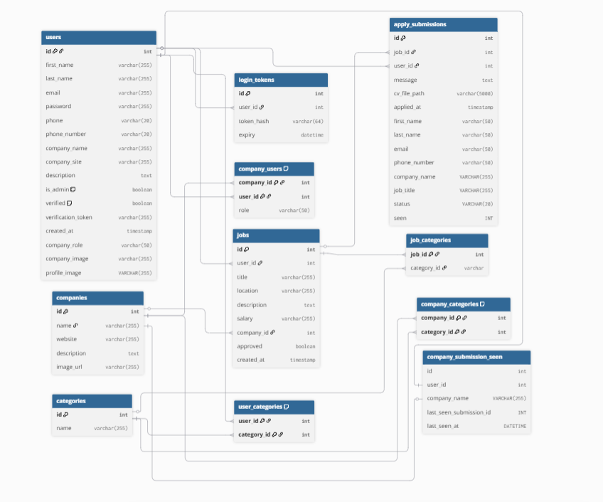

# tues-Internship-2025-aklas

## Overview

This project is a web-based job management platform for students, workers, companies, and administrators. It allows users to register, manage profiles, post and apply for jobs, and for admins to manage all data and users. The system is built with PHP (backend), MySQL (database), and JavaScript (frontend interactivity).

---

## Features

### User Management
- **Registration & Login:** Users can register, log in, and manage their profiles.
- **Two-Factor Authentication:** 2FA for enhanced security.
- **Role-based Access:** Users can be workers, company representatives, or admins.

### Job Management
- **Job Posting:** Companies can create, edit, and delete job postings.
- **Job Listing & Search:** All users can browse, search, and filter jobs by categories.
- **Job Details Modal:** Clicking a job opens a modal with full details.
- **Bulk Edit:** Admins can bulk-assign categories to jobs.

### Application Management
- **Apply for Jobs:** Students/workers can apply for jobs, upload CVs, and track their applications.
- **Application Review:** Companies and admins can review, approve, or reject applications.
- **Submission Status:** Applications have statuses (pending, approved, rejected, seen).

### Categories & Filtering
- **Category Management:** Admins can create, edit, and delete categories.
- **Job Categorization:** Jobs can belong to multiple categories.
- **Category Filtering:** Users can filter jobs by category.

### Company Management
- **Company Profiles:** Companies have profiles, can upload logos, and manage their job postings.
- **Company-User Roles:** Multiple users can be associated with a company, each with a role.

### Admin Dashboard
- **User & Job Overview:** Admins can view all users, jobs, and applications.
- **Approve/Reject Jobs:** Admins can approve or reject job postings.
- **Pagination:** Jobs can be paginated. There can be five jobs on every page.

### Other Features
- **Google Maps Integration:** Job locations can be viewed in a modal with an embedded Google Map.
- **Responsive Design:** The UI is responsive and works on desktop and mobile.
- **Security:** Uses prepared statements, session management, and role checks.

---

## Validation & Security

### Location Validation
- The platform validates job locations using the Google Maps Geocoding API (see `validate-location.php`).
- When a user enters a location (e.g., when creating a job), the backend checks if the location is valid by querying the Google Maps API.
- If the location is not recognized, the user is prompted to enter a valid location.

### Route Validation & Access Control
- The platform uses route validation to restrict access to certain pages:
  - `require_login.php` ensures that only logged-in users can access protected routes.
  - `require_admin.php` ensures that only admin users can access admin-only routes (like the dashboard).
- Unauthorized users are redirected to the login page or shown an error message.

---

## Technologies Used

- **Backend:** PHP 6
- **Frontend:** HTML5, CSS3 (Sass), JavaScript (vanilla)
- **Database:** MySQL (see schema below)
- **Other:** Google Fonts, Google Maps Embed, AJAX for dynamic updates

---

## Database Schema

The system uses a relational MySQL database. Below is the DB diagram:

**Main Tables:**
- `users`: Stores user info, roles, and authentication data.
- `companies`: Company profiles and info.
- `jobs`: Job postings.
- `categories`: Job categories.
- `apply_submissions`: Applications for jobs.
- `login_tokens`: For session management.
- `job_categories`, `user_categories`, `company_users`, `company_categories`: Many-to-many relationship tables.
- `company_submission_seen`: Tracks which submissions have been seen by companies.

---

## Folder Structure

- `dashboard.php` - Admin dashboard for managing jobs and users.
- `main.js`, `dashboard.js` - JavaScript for interactivity, modals, AJAX, etc.
- `job-details-popup.php` - Modal for job details.
- `category-dashboard.php` - Category management for admins.
- `apply-submission.php` - Job application form.
- `register.php`, `login.php`, `logout.php` - Authentication.
- `profile.php` - User profile management.
- `submissions.php`, `my-submission.php`, `my-company-submissions.php` - Application tracking.
- `css/`, `sass/` - Stylesheets.
- `uploads/` - Uploaded files (CVs, images).
- `dbconn.php` - Database connection.
- `pagination.php` - Pagination logic.
- `require_login.php`, `require_admin.php` - Access control.

---

## How to Run

1. **Clone the repository.**
2. **Set up a MySQL database** using the provided schema.
3. **Configure `dbconn.php`** with your database credentials.
4. **Run the project** on a local server (e.g., XAMPP, MAMP, WAMP).
5. **Access the app** via `http://localhost/tues-Internship-2025-aklas/`.

---

## Notes

- Make sure to set correct file permissions for the `uploads/` directory.
- For Google Maps integration, you may need a valid API key for advanced features.
- The project is modular and can be extended with more features as needed.
